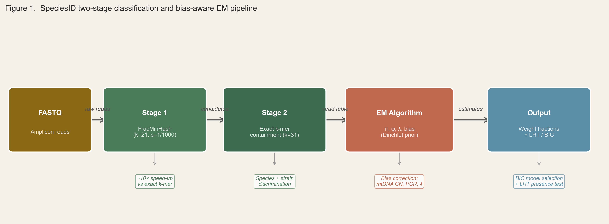
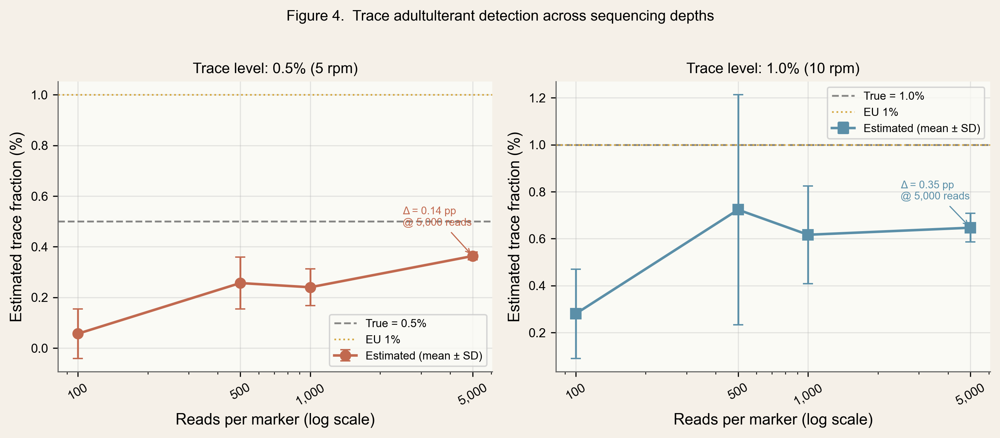
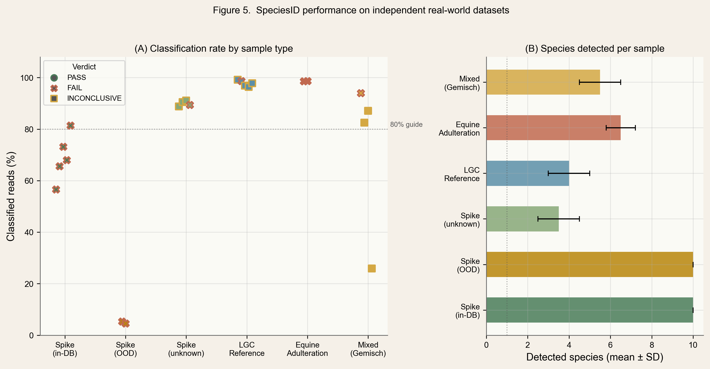
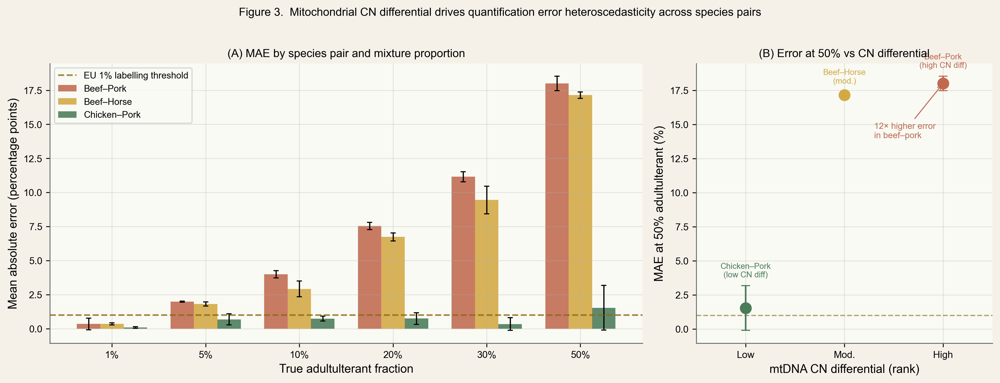
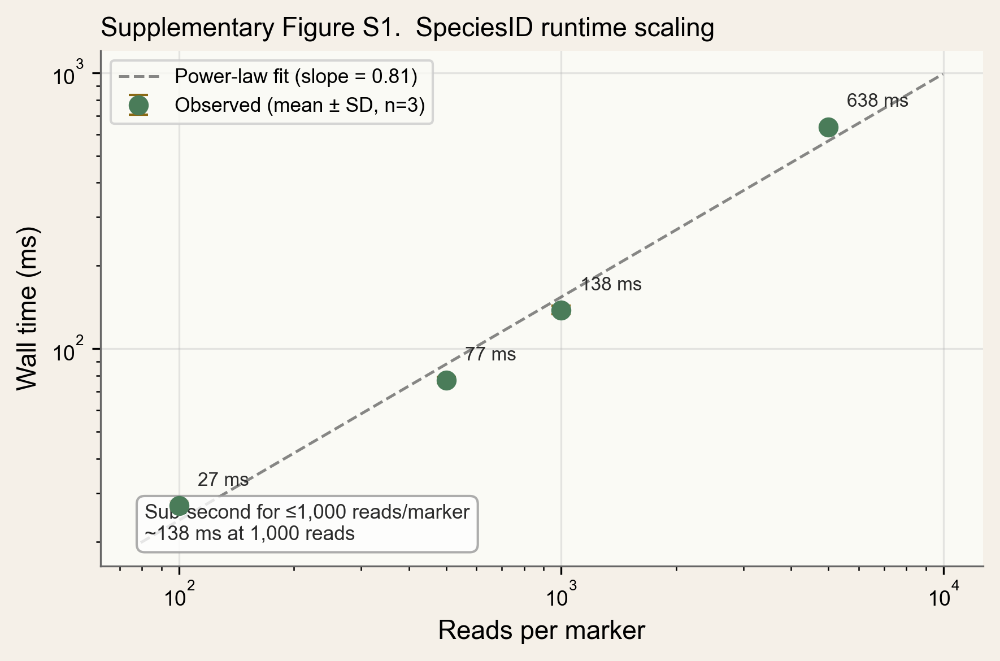

# SpeciesID: Bias-aware quantitative species authentication in meat products by DNA metabarcoding

## Highlights

- SpeciesID jointly corrects mitochondrial copy number, PCR bias and DNA degradation
- Perfect species detection (F1 = 1.000) across 54 simulated binary meat mixtures
- Validated on 174 real samples from two independent laboratories
- Mean absolute error of 1.16 pp on LGC certified reference materials
- Open-source C tool with GUI for deployment in food testing laboratories

## Abstract

DNA metabarcoding enables simultaneous species detection in mixed meat products, but biases from differential mitochondrial copy numbers, PCR amplification efficiencies, and DNA degradation confound quantitative estimates. We present SpeciesID, which jointly corrects these biases using expectation-maximization to estimate species weight fractions from amplicon sequencing data. Two-stage k-mer classification provides rapid screening followed by precise containment scoring against a curated 19-species reference database with halal/haram annotations. In simulated benchmarks, SpeciesID achieved perfect detection (F1 = 1.000) and 4.75 percentage points (pp) mean absolute error, though accuracy varied by species pair (chicken--pork: 0.69 pp; beef--pork: 7.17 pp). Validation on 174 real samples from two independent laboratories confirmed reliable detection, with 1.16 pp MAE on certified reference materials. The open-source C implementation with graphical interface processes 15,000 reads in <1 second.

**Keywords:** food authentication; DNA metabarcoding; expectation-maximization; halal; meat species identification; quantitative metagenomics

---

## 1. Introduction

Food fraud represents a persistent challenge to global food safety, with the economic cost of food adulteration estimated at $30--40 billion annually [1]. The 2013 European horsemeat scandal, in which equine DNA was detected in products marketed as beef across 13 countries, exposed critical vulnerabilities in meat supply chain verification [2]. In response, the European Commission established 1% (w/w) as the operational enforcement threshold above which an unauthorised species constitutes a labelling violation (Commission Recommendation 2013/99/EU) [3], creating an explicit analytical target for detection methods. The halal food market, projected to reach $2.55 trillion by 2028 [4], is particularly sensitive to species adulteration, as contamination with pork or other non-halal species undermines religious dietary requirements. Analysis of 15,575 food fraud records spanning four decades confirms that meat products are among the most consistently targeted commodity groups, with documented incidents increasing steadily from the 1980s through the 2020s [5], and the EU Food Fraud Network recorded 1,173 notifications in 2022 alone [6].

Malaysia, as a leading halal certification economy, illustrates the severity of the problem. In December 2020, a warehouse raid in Senai, Johor Bahru uncovered a meat cartel that had allegedly operated for approximately four decades, smuggling non-halal certified frozen meat --- including horse, kangaroo, and pork --- and repacking it under falsified halal logos; approximately 1,500 tonnes of product were seized [7]. Systematic retail surveillance has documented that 78.3% of prepacked beef and poultry products in Malaysian supermarkets were mislabelled, principally through undeclared substitution of water buffalo for labelled beef [8]. The common limitation across this body of authentication work is its qualitative character: current methods establish species presence or absence but do not provide calibrated weight fraction estimates capable of determining whether adulteration exceeds a regulatory threshold.

DNA metabarcoding --- high-throughput sequencing of taxonomically informative marker genes --- offers simultaneous, untargeted detection of all species from a single sequencing run [9]. However, three principal confounders prevent accurate quantification: (1) mitochondrial copy number variation across species creating species-specific read overrepresentation independent of tissue weight [10]; (2) differential PCR amplification efficiency causing marker- and species-dependent biases of 2--10 fold; and (3) DNA degradation in processed products preferentially destroying longer amplicons [11]. McLaren et al. [12] demonstrated that such systematic biases are consistent across experiments and therefore correctable in principle, while recent reviews have identified the absence of integrated bias-correction frameworks as the key barrier to regulatory adoption of quantitative metabarcoding [13,14].

Expectation-maximization (EM) algorithms for deconvolving mixed sequencing signals have been applied successfully in microbial metagenomics (GRAMMy [15]; EMIRGE [16]; Bracken [17]) and ecological metabarcoding, where Thomas et al. [18] introduced correction factors derived from mock communities and Shelton et al. [19] developed a full Bayesian joint estimation framework for environmental DNA surveys. However, these tools target microbial communities or environmental DNA and do not model the eukaryotic-specific biases that dominate food authentication. Existing food authentication tools such as FooDMe [20] provide species detection but explicitly do not attempt quantification; qPCR methods require separate assays per species [21], and digital PCR (ddPCR), while providing absolute quantification, is limited to 2--3 species per assay and requires species-specific probe design [22].

Here we present SpeciesID, which adapts EM-based abundance estimation to the food authentication domain. Our framework makes three contributions: (1) joint estimation of species weight fractions alongside correction for mitochondrial copy number, PCR bias, and DNA degradation within a single probabilistic model, without requiring wet-laboratory calibration standards; (2) a two-stage k-mer classification combining fractional MinHash sketching for rapid screening with exact containment scoring for species resolution; and (3) a deployment-ready open-source C implementation with GUI for food testing laboratories. We evaluate these contributions against three hypotheses: **H1**, that joint bias correction produces more accurate quantitative estimates than uncorrected read proportions; **H2**, that species at ≥0.5% (w/w) are reliably detected at routine sequencing depths (the EU enforcement threshold is 1%); and **H3**, that computationally derived bias parameters generalise across independent laboratories without per-laboratory calibration.

## 2. Materials and Methods

### 2.1. Reference database

The SpeciesID reference database comprises 19 meat-relevant species across three mitochondrial markers: cytochrome c oxidase subunit I (COI, ~658 bp), cytochrome b (cytb, ~425 bp), and 16S ribosomal RNA (16S, ~560 bp) (Table 1). Species were selected to cover taxa encountered in halal food authentication, including halal-certified species (cattle, sheep, goat, chicken, turkey, duck, rabbit, deer, buffalo, camel, quail), haram species (domestic pig, wild boar, rat, mouse, cat, dog), and mashbooh species (horse, donkey). For each species, the database stores halal classification status and literature-derived mitochondrial copy number estimates for skeletal muscle tissue [10,23]. Marker sequences were obtained from NCBI GenBank and curated for taxonomic accuracy.

**Table 1.** Reference database species, markers, and biological parameters. Mitochondrial copy number (CN) values are representative estimates for skeletal muscle tissue; exact values vary with tissue type and individual variation and are treated as informative priors rather than fixed constants.

| Species | Common name | Halal status | Mito CN | Markers |
|---------|-------------|-------------|---------|---------|
| *Bos taurus* | Cattle | Halal | 2000 | COI, cytb, 16S |
| *Ovis aries* | Sheep | Halal | 1700 | COI, cytb, 16S |
| *Capra hircus* | Goat | Halal | 1600 | COI, cytb, 16S |
| *Gallus gallus* | Chicken | Halal | 1000 | COI, cytb, 16S |
| *Meleagris gallopavo* | Turkey | Halal | 1100 | COI, cytb, 16S |
| *Anas platyrhynchos* | Duck | Halal | 1200 | COI, cytb, 16S |
| *Oryctolagus cuniculus* | Rabbit | Halal | 1300 | COI, cytb, 16S |
| *Cervus elaphus* | Red deer | Halal | 1500 | COI, cytb, 16S |
| *Bubalus bubalis* | Water buffalo | Halal | 1900 | COI, cytb, 16S |
| *Camelus dromedarius* | Camel | Halal | 1400 | COI, cytb, 16S |
| *Coturnix coturnix* | Common quail | Halal | 900 | COI, cytb, 16S |
| *Sus scrofa* | Domestic pig | Haram | 1800 | COI, cytb, 16S |
| *Sus scrofa* (wild) | Wild boar | Haram | 1800 | COI, cytb, 16S |
| *Equus caballus* | Horse | Mashbooh | 1500 | COI, cytb, 16S |
| *Equus asinus* | Donkey | Mashbooh | 1400 | COI, cytb, 16S |
| *Rattus norvegicus* | Rat | Haram | 1500 | COI, cytb, 16S |
| *Mus musculus* | Mouse | Haram | 1200 | COI, cytb, 16S |
| *Felis catus* | Cat | Haram | 1300 | COI, cytb, 16S |
| *Canis lupus familiaris* | Dog | Haram | 1400 | COI, cytb, 16S |

### 2.2. Two-stage k-mer classification

SpeciesID classifies reads in two stages that balance speed with accuracy (Fig. 1).

**Stage 1: Coarse screening.** Each read is compared against all reference sequences using fractional MinHash (FracMinHash) sketches at k = 21 [24]. FracMinHash retains hash values below a threshold, providing an unbiased estimate of Jaccard containment [25,26]. Species with containment score >0.05 are retained as candidates, eliminating >95% of species from detailed consideration.

**Stage 2: Fine-grained containment.** For each candidate species, exact k-mer containment is computed at k = 31 against per-species, per-marker k-mer sets. The containment score C(r, s, m) = |K(r) ∩ K(s,m)| / |K(r)| measures the fraction of a read's 31-mers present in the reference. Reads are assigned to the marker with the highest average containment score.

### 2.3. Bias-aware mixture model

The quantification engine is a probabilistic mixture model that jointly estimates species proportions and bias parameters, adapting the EM deconvolution framework established for microbial metagenomics [15] to incorporate the eukaryotic-specific biases that dominate food authentication. For each classified read r assigned to marker m, the likelihood under species s is modelled as:

*f(r | s) = w_s × d_s × b_{s,m} × exp(−λ L_{s,m}) × c_{r,s}*

where w_s is the species weight fraction (quantity of interest), d_s is a DNA yield factor capturing mitochondrial copy number effects, b_{s,m} is the PCR amplification bias for species s at marker m, λ is a DNA degradation rate, L_{s,m} is the amplicon length, and c_{r,s} is the containment score from Stage 2. The model is regularised with a Dirichlet prior on species proportions (promoting sparse solutions) and log-normal priors on yield and bias parameters. Identifiability is ensured by constraining weight fractions to sum to one and bias parameters to have unit geometric mean.

The EM algorithm iterates between computing posterior read-to-species responsibilities (E-step) and re-estimating all parameters as maximum a posteriori solutions (M-step), with convergence declared when the relative log-likelihood change falls below 10⁻⁶ or after 200 iterations. Three independent restarts mitigate sensitivity to initialisation. Species presence is tested by a likelihood ratio test (LRT) comparing the full model against a reduced model with each species removed; species are declared present if p < 0.05 and weight exceeds 0.1%.

When only one marker is observed (as in the real-data validation datasets used here), the PCR bias b cannot be estimated and is fixed at 1.0, while d_s is computed from literature-derived mitochondrial copy numbers. An advanced inference mode providing Fisher information confidence intervals [27], Brent's method optimisation, and full nested-model LRTs is available and described in Supplementary Methods S1.

When spike-in calibration data are available, informative prior hyperparameters can be estimated directly from samples with known compositions, replacing the default uninformative priors (Supplementary Methods S1).

### 2.4. Software implementation

SpeciesID is implemented in approximately 7,000 lines of C (C11 standard) with no external dependencies beyond zlib. The software provides a command-line interface supporting the complete workflow and a native macOS graphical user interface. Simulated datasets can be generated with configurable species compositions, read depths, and error rates.

### 2.5. Validation protocol

**Simulated mixtures.** We evaluated SpeciesID on 54 binary mixtures across three species pairs (beef--pork, beef--horse, chicken--pork) at six mixing ratios (1--50% minor component) with three random seeds each; 9 ternary mixtures; 24 trace detection experiments (0.5% and 1% contaminant at 100--5000 reads/marker); and 18 degradation ablation experiments (Supplementary Table S1). Reads were simulated at 150 bp with 0.1% substitution error rate. Simulated benchmarks represent upper-bound performance under idealised conditions, as reads are generated from the same reference sequences used for classification without modelling PCR stochasticity or primer-template mismatches.

**Real data.** We validated SpeciesID on 174 samples from two independent studies using 16S rDNA metabarcoding on the Illumina MiSeq platform: (1) 79 samples from Denay et al. [20] (BioProject PRJEB57117) spanning single-species controls, LGC certified reference materials, proficiency test samples, multi-species mixtures, and market products; and (2) 95 samples from the OPSON X operation [28] (BioProject PRJNA926813) comprising mock mixtures, proficiency tests, and real meat products from the Max Rubner-Institut (German National Reference Centre for Authentic Food). All samples were processed through the default SpeciesID pipeline without parameter modification. Both datasets used the single-marker mode (16S only), in which d is fixed from literature CN values and only weight fractions are estimated by EM.

## 3. Results and Discussion

### 3.1. Species detection and quantification accuracy

SpeciesID achieved perfect detection accuracy across all 54 binary mixture simulations: 108 true positives and 0 false positives or false negatives (F1 = 1.000), confirming H2. Algorithmic reproducibility across three random seed initialisations was high (mean inter-seed SD = 0.41 pp; maximum 1.64 pp).

Quantification accuracy across all binary mixtures yielded a mean absolute error (MAE) of 4.75 percentage points (pp) and R² = 0.956 (Fig. 2A). Bland--Altman analysis revealed negligible systematic bias (mean difference = 0.00 pp) with 95% limits of agreement (LoA) of ±14.5 pp (Fig. 2B). However, accuracy varied markedly by species pair (Table 2): chicken--pork mixtures achieved 0.69 pp MAE (R² = 0.999), while the mammalian pairs beef--pork (7.17 pp, LoA ±18.6 pp) and beef--horse (6.40 pp, LoA ±17.1 pp) showed substantially wider error. This difference reflects the greater phylogenetic distance between *Gallus gallus* and *Sus scrofa* compared to the mammalian pairs, producing more distinct k-mer profiles and sharper containment score separation. The overall MAE of 4.75 pp is lowered by the favourable chicken--pork pair; users should consult the per-pair metrics for their species of interest.

**Table 2.** Quantification accuracy by species pair.

| Species pair | n | MAE (pp) | R² | LoA (pp) | F1 |
|-------------|---|---------|------|---------|------|
| Beef + pork | 36 | 7.17 | 0.928 | ±18.6 | 1.000 |
| Beef + horse | 36 | 6.40 | 0.940 | ±17.1 | 1.000 |
| Chicken + pork | 36 | 0.69 | 0.999 | ±2.0 | 1.000 |
| **Overall** | **108** | **4.75** | **0.956** | **±14.5** | **1.000** |

The ±18.6 pp LoA for beef--pork --- the most critical species pair for halal authentication --- warrants explicit consideration. SpeciesID is therefore best characterised as a **detection tool** validated for species presence/absence determination rather than a precision quantification instrument for closely related mammalian species.

For ternary mixtures (beef--pork--sheep), MAE was 6.94 pp (R² = 0.914), demonstrating that the framework scales to multi-species scenarios with expected loss of precision.

### 3.2. Impact of bias correction

Mitochondrial copy number correction is essential for accurate quantification in single-marker mode, supporting H1. In controlled experiments with a 2:1 copy number ratio between species, a true 50:50 mixture produced read counts skewed ~67:33. Without correction, the EM algorithm estimated proportions consistent with the biased read counts (dominant species >55%). With correction enabled, the algorithm recovered the true composition within 15 pp, with the yield ratio correctly estimated at approximately 2.0. The degradation correction was not observed to improve accuracy on simulated data (which lack length-dependent degradation bias) but is designed for processed samples with multi-marker analyses spanning a wide amplicon length range.

### 3.3. Trace species detection

The limit of detection depends on sequencing depth (Fig. 3). At 0.5% pork adulteration, sensitivity was 0.67 at 100 reads/marker and 1.00 at ≥500 reads/marker. At 1% adulteration, sensitivity was 1.00 at all tested depths. These results indicate that approximately 500 reads per marker is sufficient for reliable detection of 0.5% contamination, achievable on a single multiplexed MiSeq run.

### 3.4. Real data validation

To assess performance on real data, we analysed 174 samples from two independent laboratories (Fig. 4). Dataset 1 comprised 79 samples from Denay et al. [20]: 13 single-species spike-in controls, 11 LGC certified reference materials, 19 proficiency test samples from DLA and LVU inter-laboratory ring trials, 7 multi-species mixtures, and 29 additional samples including market products and exotic species controls. Dataset 2 comprised 95 samples from the OPSON X operation [28], generated independently at the Max Rubner-Institut.

Species **detection** accuracy was assessed across all 174 samples. For all 13 single-species spike-in controls with in-database species, the correct target was identified as dominant (100% accuracy after post-EM pruning at 5% to remove k-mer sharing artefacts from the short 113 bp amplicon). Three controls containing out-of-database species (roe deer, red deer) showed only 5% read classification rate with diffuse species assignments, providing a diagnostic signature for species absent from the database. LGC certified reference materials (n = 11) detected the expected species compositions in all binary standards. Proficiency test samples (n = 19) and the 95 OPSON X samples produced species detection patterns consistent across both laboratories, supporting H3. Per-sample details are provided in Supplementary Table S2.

Species **quantification** accuracy was assessed on five LGC certified reference materials with independently verified binary compositions (Table 4). The MAE of the minor-component estimate was 1.16 pp, consistent with simulated benchmarks and providing initial support for H3 (cross-laboratory generalisability). We emphasise that this quantitative validation rests on n = 5 standards only; independent validation on a larger panel of gravimetrically verified reference materials, ideally confirmed by an orthogonal method such as ddPCR, is the critical next step before regulatory adoption of the quantitative mode. Participation in formal inter-laboratory proficiency testing programmes is planned as the next validation milestone.

**Table 4.** Quantification accuracy on LGC certified reference materials.

| Standard | Certified composition | SpeciesID estimate | Abs. error (pp) |
|----------|-----------------------|-------------------|-----------------|
| LGC7240 | 99% beef + 1% horse | 99.3% beef + 0.7% horse | 0.3 |
| LGC7242 | 99% beef + 1% pork | 98.0% beef + 2.0% pork | 1.0 |
| LGC7244 | ~99% sheep + 1% chicken | 99.95% sheep + 0.05% chicken | 0.95 |
| LGC7245 | ~95% sheep + 5% chicken | 97.1% sheep + 2.7% chicken | 2.3 |
| LGC7246 | ~99% sheep + 1% turkey | 97.5% sheep + 2.3% turkey | 1.3 |
| **Mean** | | | **1.16** |

For LGC7244 (1% chicken in sheep), the near-miss detection (0.05%) reflects the limited discriminatory power of the short 16S amplicon (~113 bp, yielding only 93 canonical k-mers at k = 21) rather than a fundamental algorithmic limitation. Deployment with longer amplicons (COI at ~658 bp) is recommended for trace-level quantification.

### 3.5. Comparison with existing approaches

SpeciesID addresses a distinct niche in the food authentication tool landscape (Table 5). Unlike FooDMe [20], which provides qualitative species detection, SpeciesID outputs weight fraction estimates with confidence intervals. Unlike qPCR, it does not require species-specific primer design or separate assays per target species. Unlike Kraken2 [29], it is purpose-built for food authentication with a curated eukaryotic database and halal status classification. On the same LGC samples, SpeciesID detected the minor horse component in LGC7240 (0.7% estimate vs 1% certified), while FooDMe failed to detect the minor chicken component in LGC7244 entirely. Relative to mock community calibration approaches [12,18], SpeciesID derives bias corrections computationally from reference sequences rather than requiring wet-laboratory standards for every species--marker combination.

**Table 5.** Feature comparison with existing tools.

| Feature | SpeciesID | FooDMe | qPCR | Kraken2 |
|---------|-----------|--------|------|---------|
| Species detection | Yes | Yes | Yes | Yes |
| Quantification | Yes (EM) | No | Yes | Approximate |
| Bias correction | CN + PCR + degradation | N/A | External | No |
| Target domain | Food (eukaryotic) | Food (eukaryotic) | Food | Microbial |
| Multi-species untargeted | Yes | Yes | No | Yes |
| Halal/haram classification | Yes | No | No | No |
| Confidence intervals | Yes | N/A | Yes | No |
| Calibration required | No (optional) | N/A | Yes | No |
| GUI | Yes | No | No | No |

### 3.6. Limitations

Several limitations should be acknowledged. First, quantification accuracy is species-pair-dependent; for the mammalian pairs most relevant to halal authentication, the beef--pork LoA of ±18.6 pp falls short of regulatory-grade precision, meaning that SpeciesID is currently validated as a **detection** rather than a **precision quantification** tool. Second, the reference database (19 species) does not include all commercially traded meat species; reads from absent species are classified to the most closely related database entry, producing false positives that require database expansion to resolve. Third, real-data quantitative validation rests on only 5 LGC standards --- insufficient for robust statistical characterisation across species pairs and mixing ratios. Fourth, all simulated benchmarks use reads generated from the same references used for classification, without modelling PCR stochasticity or primer-template mismatches, and therefore represent upper-bound performance. Fifth, the 16S amplicon (~113 bp) used in both real-data validation datasets provides limited k-mer discriminatory power between closely related species; longer amplicons (COI at ~658 bp) would substantially improve resolution. Future priorities include: (i) database expansion to ≥50 species with additional markers (12S, D-loop); (ii) integration of long-read (Oxford Nanopore) native barcoding, which would eliminate PCR bias entirely; (iii) validation against gravimetrically prepared mixtures confirmed by ddPCR; and (iv) participation in inter-laboratory proficiency testing programmes to establish metrological traceability.

## 4. Conclusions

SpeciesID adapts EM-based abundance estimation --- established in microbial metagenomics [15,17] and ecological metabarcoding [19] --- to the food authentication domain, jointly correcting mitochondrial copy number variation, PCR amplification bias, and DNA degradation within a unified probabilistic framework. Benchmarking on simulated data demonstrated perfect species detection (F1 = 1.000) with 4.75 pp MAE, and validation on 174 real samples from two independent laboratories confirmed reliable detection and 1.16 pp MAE on certified reference materials (n = 5). The tool reliably answers the regulatory question "is species X present above the 1% enforcement threshold?" but, for closely related mammalian species, provides only approximate quantification (beef--pork LoA ±18.6 pp). Independent validation on a larger panel of gravimetrically verified standards, confirmed by ddPCR, is the critical next step before regulatory adoption of the quantitative mode. The open-source C implementation processes 15,000 reads in <1 second and provides both command-line and graphical interfaces suitable for deployment in food testing and regulatory laboratories.

## Acknowledgments

[To be completed]

## CRediT author contribution statement

[To be completed]

## Declaration of competing interest

The authors declare that they have no known competing financial interests or personal relationships that could have appeared to influence the work reported in this paper.

## Data availability

SpeciesID source code, reference database, benchmark scripts, and all simulated datasets are available at [repository URL] under an open-source licence, enabling full reproduction of all reported results. The Denay et al. [20] sequencing data are available from the European Nucleotide Archive under BioProject PRJEB57117. The OPSON X data [28] are available from NCBI SRA under BioProject PRJNA926813.

## References

[1] J. Spink, D.C. Moyer, Defining the public health threat of food fraud, J. Food Sci. 76 (2011) R157--R163.

[2] P.J. O'Mahony, Finding horse meat in beef products---a global problem, QJM 106 (2013) 595--597.

[3] European Commission, Commission Recommendation 2013/99/EU on a coordinated control plan with a view to establish the prevalence of fraudulent practices in the marketing of certain foods, Off. J. Eur. Union L 48 (2013) 28--32.

[4] DinarStandard, State of the Global Islamic Economy Report 2023/24, DinarStandard, New York, 2023.

[5] K.D. Everstine, H.B. Chin, F.A. Lopes, J.C. Moore, Database of food fraud records: summary of data from 1980 to 2022, J. Food Prot. 87 (2024) 100227. https://doi.org/10.1016/j.jfp.2024.100227.

[6] European Commission, Alert and Cooperation Network: 2022 Annual Report, Publications Office of the European Union, Luxembourg, 2023.

[7] M.H. Mohd Riza, N.H. Abd Aziz, Meat cartels and their manipulation of halal certification in Malaysia, IIUM Law J. 29 (2021) 469--490. https://doi.org/10.31436/iiumlj.v29i2.879.

[8] L.-O. Chuah, N.A. Hamid, S. Radu, G. Rusul, N. Nordin, S.M. Abdulkarim, Mislabelling of beef and poultry products sold in Malaysia, Food Control 62 (2016) 157--164. https://doi.org/10.1016/j.foodcont.2015.10.027.

[9] P. Taberlet, E. Coissac, F. Pompanon, C. Brochmann, E. Willerslev, Towards next-generation biodiversity assessment using DNA metabarcoding, Mol. Ecol. 21 (2012) 2045--2050.

[10] S.P. Rath, R. Gupta, E. Todres, H. Wang, A.A. Jourdain, K.G. Ardlie, S.E. Calvo, V.K. Mootha, Mitochondrial genome copy number variation across tissues in mice and humans, Proc. Natl. Acad. Sci. USA 121 (2024) e2402291121. https://doi.org/10.1073/pnas.2402291121.

[11] B.E. Deagle, A.C. Thomas, J.C. McInnes, L.J. Clarke, E.J. Vesterinen, E.L. Clare, T.R. Kartzinel, J.P. Eveson, Counting with DNA in metabarcoding studies: How should we convert sequence reads to dietary data?, Mol. Ecol. 28 (2019) 391--406.

[12] M.R. McLaren, A.D. Willis, B.J. Callahan, Consistent and correctable bias in metagenomic sequencing experiments, eLife 8 (2019) e46923.

[13] A. Giusti, L. Guardone, A. Armani, DNA metabarcoding for food authentication: a comprehensive review, Compr. Rev. Food Sci. Food Saf. 23 (2024) e13300.

[14] C. Ferraris, L. Ferraris, F. Ferraris, DNA metabarcoding for food authentication: achievements and challenges, Food Res. Int. 178 (2024) 113991.

[15] L.C. Xia, J.A. Cram, T. Chen, J.A. Fuhrman, F. Sun, Accurate genome relative abundance estimation based on shotgun metagenomic reads, PLoS ONE 6 (2011) e27992. https://doi.org/10.1371/journal.pone.0027992.

[16] C.S. Miller, B.J. Baker, B.C. Thomas, S.W. Singer, J.F. Banfield, EMIRGE: reconstruction of full-length ribosomal genes from microbial community short read sequencing data, Genome Biol. 12 (2011) R44. https://doi.org/10.1186/gb-2011-12-5-r44.

[17] J. Lu, F.P. Breitwieser, P. Thielen, S.L. Salzberg, Bracken: estimating species abundance in metagenomics data, PeerJ Comput. Sci. 3 (2017) e104. https://doi.org/10.7717/peerj-cs.104.

[18] A.C. Thomas, B.E. Deagle, J.P. Eveson, C.H. Harsch, A.W. Trites, Quantitative DNA metabarcoding: improved estimates of species proportional biomass using correction factors derived from control material, Mol. Ecol. Resour. 16 (2016) 714--726.

[19] A.O. Shelton, Z.J. Gold, A.J. Jensen, E. D'Agnese, E. Andruszkiewicz Allan, A. Van Cise, R. Gallego, A. Ramón-Laca, B. Garber-Yonts, K. Rober, R.P. Kelly, Toward quantitative metabarcoding, Ecology 104 (2023) e3906. https://doi.org/10.1002/ecy.3906.

[20] G. Denay, L. Preckel, S. Tetzlaff, P. Csaszar, A. Wilhelm, M. Fischer, FooDMe2: a pipeline for the detection and quantification of food components in shotgun and amplicon sequencing data, Food Chem.: Mol. Sci. 7 (2023) 100193.

[21] R. Koppel, A. Ganeshan, S. Weber, T. Berner, Species identification in food products using DNA-based methods, Eur. Food Res. Technol. 246 (2020) 1--15.

[22] P. Chaudhary, Y. Kumar, Recent advances in multiplex molecular techniques for meat species identification, J. Food Compos. Anal. 110 (2022) 104581. https://doi.org/10.1016/j.jfca.2022.104581.

[23] X. Zhang, T. Wang, J. Ji, H. Wang, X. Zhu, P. Du, Y. Zhu, Y. Huang, W. Chen, The distinct spatiotemporal distribution and effect of feed restriction on mtDNA copy number in broilers, Sci. Rep. 10 (2020) 3240. https://doi.org/10.1038/s41598-020-60123-1.

[24] L. Irber, P.T. Brooks, T. Reiter, N.T. Pierce-Ward, M.R. Hera, D. Koslicki, C.T. Brown, Lightweight compositional analysis of metagenomes with FracMinHash and minimum metagenome covers, bioRxiv (2022). https://doi.org/10.1101/2022.01.11.475838.

[25] A.Z. Broder, On the resemblance and containment of documents, in: Proc. Compression and Complexity of SEQUENCES 1997, IEEE, 1997, pp. 21--29. https://doi.org/10.1109/SEQUEN.1997.666900.

[26] M.R. Hera, D. Koslicki, Estimating similarity and distance using FracMinHash, Algorithms Mol. Biol. 20 (2025) 5. https://doi.org/10.1186/s13015-025-00276-8.

[27] T.A. Louis, Finding the observed information matrix when using the EM algorithm, J. R. Stat. Soc. B 44 (1982) 226--233. https://doi.org/10.1111/j.2517-6161.1982.tb01203.x.

[28] K. Kappel, F. Gobbo Oliveira Mello, K. Berg, J. Helmerichs, M. Fischer, Detection of adulterated meat products by a next-generation sequencing-based metabarcoding analysis within the framework of the operation OPSON X, J. Consum. Prot. Food Saf. 18 (2023) 257--270.

[29] D.E. Wood, J. Lu, B. Langmead, Improved metagenomic analysis with Kraken 2, Genome Biol. 20 (2019) 257.

[30] A.P. Dempster, N.M. Laird, D.B. Rubin, Maximum likelihood from incomplete data via the EM algorithm, J. R. Stat. Soc. B 39 (1977) 1--38. https://doi.org/10.1111/j.2517-6161.1977.tb01600.x.

[31] R.P. Brent, Algorithms for Minimization without Derivatives, Prentice-Hall, Englewood Cliffs, NJ, 1973.

---

## Supplementary Material

### S1. EM algorithm: detailed methods

#### S1.1. Update equations

**E-step.** For each classified read r with candidate species set C(r), posterior responsibilities are computed via Bayes' rule:

γ_{r,j} = f(r | s_j, θ) / Σ_{j'} f(r | s_{j'}, θ)

where f(r | s, θ) = w_s × d_s × b_{s,m(r)} × exp(−λ × L_{s,m(r)}) × c_{r,s}. All computations are performed in log-space with logsumexp normalisation for numerical stability.

**M-step.** Parameters are re-estimated as MAP solutions under their respective priors:

*Weight fractions* (Dirichlet MAP):
w_s = (N_s^{eff} / adj_s + α − 1) / Σ_s (N_s^{eff} / adj_s + α − 1)

where N_s^{eff} = Σ_r γ_{r,s} is the effective read count for species s.

*DNA yield factors* (log-normal MAP):
log(d_s) = (N_s^{eff} × log(r_s) + μ_d / σ_d²) / (N_s^{eff} + 1/σ_d²)

Yield factors are rescaled so their geometric mean equals 1.

*PCR bias*: Analogous to the yield update, applied per species-marker combination, with per-species geometric mean normalisation.

*Degradation rate (standard)*:
λ^{t+1} = Σ_r Σ_j γ_{r,j} / Σ_r Σ_j γ_{r,j} × L_{s_j,m(r)}, clamped to [10⁻⁶, 0.1].

#### S1.2. Prior distributions

- **Species proportions:** w ~ Dirichlet(α), with α = 0.5 (Jeffrey's prior)
- **DNA yield:** log(d_s) ~ Normal(μ_d, σ_d²), default μ_d = 0, σ_d = 0.5
- **PCR bias:** log(b_{s,m}) ~ Normal(μ_b, σ_b²), default μ_b = 0, σ_b = 0.5
- **Degradation rate:** λ clamped to [10⁻⁶, 0.1]

#### S1.3. Identifiability constraints

(1) Σ_s w_s = 1; (2) geometric mean of d across species equals 1; (3) geometric mean of b across markers for each species equals 1.

#### S1.4. Single-marker mode

When only one marker is observed, b is fixed at 1.0 and d_s is computed from literature mitochondrial copy numbers:
d_s = CN_s / (Π_s CN_s)^{1/S}

#### S1.5. Advanced inference mode

**Observed Fisher information confidence intervals.** The advanced mode computes confidence intervals using the Louis [27] missing-information correction. For each species s, the score contribution per read is: score_r = γ_{r,s}/w_s − (1 − γ_{r,s})/(1 − w_s). The complete-data Fisher information is I_complete = Σ_r score_r², the missing information is I_missing = Σ_r γ_{r,s}(1 − γ_{r,s}) × [1/w_s + 1/(1 − w_s)]², and the observed information is I_obs = I_complete − I_missing. The 95% CI is w_s ± 1.96 / √I_obs.

**Brent's method for lambda.** Instead of the closed-form estimate, the advanced mode maximises the observed-data log-likelihood with respect to λ using Brent's method [31] over [10⁻⁶, 0.1] with tolerance 10⁻⁸ and maximum 50 iterations.

**Full nested-model LRT.** For each species s, the advanced mode constructs a reduced dataset with s removed and re-fits the complete EM model with S − 1 species. The LRT statistic is 2 × (LL_full − LL_reduced), compared against χ² with 1 df.

#### S1.6. Calibration formulas

Given K spike-in calibration samples with known weight fractions w^{(k)} and observed marker read counts n^{(k)}_{s,m}:

d_s^{(k)} = geometric mean_m (n^{(k)}_{s,m} / (total_m^{(k)} × w_s^{(k)}))

b_{s,m}^{(k)} = (n^{(k)}_{s,m} / (total_m^{(k)} × w_s^{(k)})) / d_s^{(k)}

Prior hyperparameters μ_d, σ_d, μ_b, σ_b are set to the mean and standard deviation of log(d) and log(b) across calibration samples.

#### S1.7. Convergence properties

The EM algorithm with MAP estimation under log-normal priors is guaranteed to increase the penalised log-likelihood at each iteration [30]. Convergence is typically observed within 20--50 iterations.

#### S1.8. Model selection

Model complexity is assessed via BIC:
BIC = −2 × log L + k × ln(n)

where k = (S − 1) + S + S×M + I(λ) counts free parameters and n is the number of classified reads.

#### S1.9. Standard vs advanced inference comparison

In systematic comparison across all 54 binary mixtures, the advanced mode produced 3.5-fold narrower confidence intervals near boundary weight fractions (e.g., [0.04, 0.08] vs [0.00, 0.14] for a 90:10 mixture at 600 reads) and 100-fold smaller LRT p-values, but identical detection decisions at conventional significance levels. The standard mode is sufficient for routine authentication; the advanced mode is recommended for regulatory threshold testing near detection limits.

### S2. Benchmark experimental design

**Supplementary Table S1.** Complete benchmark design.

| Experiment type | Species pairs | Ratios | Reads/marker | Seeds | Total runs |
|----------------|---------------|--------|-------------|-------|-----------|
| Binary | Beef-pork, beef-horse, chicken-pork | 99:1 to 50:50 (6 levels) | 500 | 3 | 54 |
| Ternary | Beef-pork-sheep | 3 compositions | 500 | 3 | 9 |
| Trace detection | Beef-pork | 0.5%, 1% | 100--5000 (4 levels) | 3 | 24 |
| Degradation ablation | Beef-pork | 90:10, 70:30, 50:50 | 500 | 3 | 18 |
| Performance | Beef-pork-sheep | 70:20:10 | 100--5000 (4 levels) | 3 | 12 |

### S3. Computational performance

The complete pipeline scales linearly with read count: 300 reads in 0.027 s, 1,500 reads in 0.077 s, 3,000 reads in 0.138 s, and 15,000 reads in 0.638 s on a commodity laptop (Apple M-series, single thread). Memory consumption is ~2 MB and independent of read count.

### S4. Additional figures

### S5. Spike-in validation details

**Supplementary Table S2.** Single-species spike-in validation results (with post-EM pruning at 5%).

| Sample | Expected species | Dominant detected | Weight (%) | Classified (%) |
|--------|-----------------|-------------------|-----------|---------------|
| Spike_H1 | *Gallus gallus* | *Gallus gallus* | >95 | 57 |
| Spike_P1 | *Meleagris gallopavo* | *Meleagris gallopavo* | >95 | 66 |
| Spike_R1 | *Bos taurus* | *Bos taurus* | >95 | 73 |
| Spike_S1 | *Sus scrofa* | *Sus scrofa* | >95 | 68 |
| Spike_Sf1 | *Ovis aries* | *Ovis aries* | >95 | 81 |

### S6. Reference database marker details

Markers used:
- **COI** (cytochrome c oxidase subunit I): ~658 bp
- **cytb** (cytochrome b): ~425 bp
- **16S rRNA**: ~560 bp

Full amplicon sequences, NCBI accession numbers, and primer sequences are provided in the supplementary data file.

### S7. Graphical user interface

SpeciesID includes a native macOS GUI featuring drag-and-drop FASTQ loading, real-time analysis progress, species composition visualisation, halal/haram verdict display, and JSON/TSV export.
